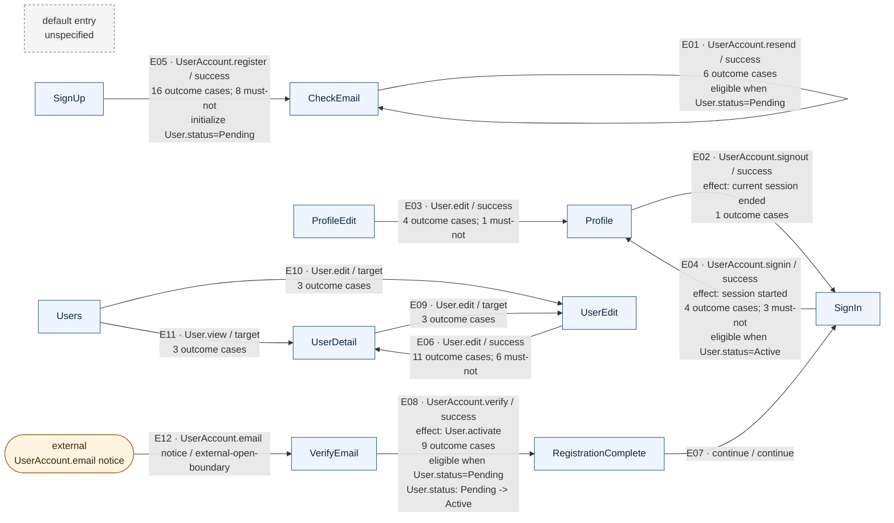

# Forma flow projection

- Schema: `forma/flow-projection/v0alpha3`
- Intent: `forma/resolved-intent/v0.11`
- Inputs: navigation `forma/navigation-projection/v0alpha2`; outcomes `forma/outcome-projection/v0alpha4`; states `forma/domain-state-projection/v0alpha1`
- Default entry: `unspecified` (not inferred)
- Navigation: 10 pages; 12 edges
- Outcomes linked to edges: 10/18 groups; 60/87 cases
- Domain state linked to edges: 5/5 elements; 5 edge annotations

## Edge index

| Ref | Route | Trigger / result | Outcome projection | Domain-state projection |
| --- | --- | --- | --- | --- |
| E01 | CheckEmail -> same context (CheckEmail) [page/CheckEmail/identity/resend/UserAccount/success] | UserAccount.resend / success | UserAccount.resend: 6 cases [identity/UserAccount/operation/resend] | eligible when User.status=Pending [projection/states/eligibility/identity/UserAccount/operation/resend/state/Pending] |
<!-- E01: navigation=page/CheckEmail/identity/resend/UserAccount/success; sources=entity/User/state/status,identity/UserAccount/identifier/email,identity/UserAccount/operation/resend,identity/UserAccount/verification/email,identity/UserAccount/verification/email/notice,page/CheckEmail,page/CheckEmail/identity/resend/UserAccount,page/CheckEmail/identity/resend/UserAccount/success -->
| E02 | Profile -> SignIn [page/Profile/identity/signout/UserAccount/success] | UserAccount.signout / success; effects=current session ended | UserAccount.signout: 1 cases [identity/UserAccount/operation/signout] | (none linked) |
<!-- E02: navigation=page/Profile/identity/signout/UserAccount/success; sources=identity/UserAccount/operation/signout,identity/UserAccount/session/current,page/Profile,page/Profile/identity/signout/UserAccount,page/Profile/identity/signout/UserAccount/success,page/Profile/view/detail/User,page/ProfileEdit,page/ProfileEdit/view/form/edit/User,page/SignIn -->
| E03 | ProfileEdit -> Profile [page/ProfileEdit/view/form/edit/User/submit/success] | User.edit / success | ProfileEdit:User.edit submit: 4 cases, 1 must-not [page/ProfileEdit/view/form/edit/User/submit] | (none linked) |
<!-- E03: navigation=page/ProfileEdit/view/form/edit/User/submit/success; sources=entity/User/field/name,entity/User/field/nickname,page/Profile,page/ProfileEdit,page/ProfileEdit/view/form/edit/User,page/ProfileEdit/view/form/edit/User/submit,page/ProfileEdit/view/form/edit/User/submit/success -->
| E04 | SignIn -> Profile [page/SignIn/identity/signin/UserAccount/success] | UserAccount.signin / success; effects=session started | UserAccount.signin: 4 cases, 3 must-not [identity/UserAccount/operation/signin] | eligible when User.status=Active [projection/states/eligibility/identity/UserAccount/operation/signin/state/Active] |
<!-- E04: navigation=page/SignIn/identity/signin/UserAccount/success; sources=entity/User/state/status,identity/UserAccount/authentication,identity/UserAccount/credential/password,identity/UserAccount/identifier/email,identity/UserAccount/operation/signin,identity/UserAccount/session/current,page/Profile,page/SignIn,page/SignIn/identity/signin/UserAccount,page/SignIn/identity/signin/UserAccount/success -->
| E05 | SignUp -> CheckEmail [page/SignUp/identity/register/UserAccount/success] | UserAccount.register / success | UserAccount.register: 16 cases, 8 must-not [identity/UserAccount/operation/register] | initialize User.status=Pending [projection/states/initializer/identity/UserAccount/operation/register] |
<!-- E05: navigation=page/SignUp/identity/register/UserAccount/success; sources=entity/User,entity/User/field/email,entity/User/field/name,entity/User/state/status,identity/UserAccount/credential/password,identity/UserAccount/identifier/email,identity/UserAccount/operation/register,identity/UserAccount/operation/resend,identity/UserAccount/operation/signin,identity/UserAccount/verification/email,identity/UserAccount/verification/email/notice,page/CheckEmail,page/SignUp,page/SignUp/identity/register/UserAccount,page/SignUp/identity/register/UserAccount/success -->
| E06 | UserEdit -> UserDetail [page/UserEdit/view/form/edit/User/submit/success] | User.edit / success | UserEdit:User.edit submit: 11 cases, 6 must-not [page/UserEdit/view/form/edit/User/submit] | (none linked) |
<!-- E06: navigation=page/UserEdit/view/form/edit/User/submit/success; sources=entity/User/field/email,entity/User/field/name,entity/User/field/nickname,entity/User/field/plan,entity/User/field/team,page/UserDetail,page/UserEdit,page/UserEdit/view/form/edit/User,page/UserEdit/view/form/edit/User/submit,page/UserEdit/view/form/edit/User/submit/access,page/UserEdit/view/form/edit/User/submit/success,type/Email/constraint/matches -->
| E07 | RegistrationComplete -> SignIn [page/VerifyEmail/identity/verify/UserAccount/continuation] | continue / continue | (none linked) | (none linked) |
<!-- E07: navigation=page/VerifyEmail/identity/verify/UserAccount/continuation; sources=page/RegistrationComplete,page/SignIn,page/VerifyEmail/identity/verify/UserAccount,page/VerifyEmail/identity/verify/UserAccount/continuation,page/VerifyEmail/identity/verify/UserAccount/success -->
| E08 | VerifyEmail -> RegistrationComplete [page/VerifyEmail/identity/verify/UserAccount/success] | UserAccount.verify / success; effects=User.activate | UserAccount.verify: 9 cases [identity/UserAccount/operation/verify] | eligible when User.status=Pending [projection/states/eligibility/identity/UserAccount/operation/verify/state/Pending]; User.status: Pending -> Active [projection/states/transition/action/User/activate/from/Pending] |
<!-- E08: navigation=page/VerifyEmail/identity/verify/UserAccount/success; sources=action/User/activate,entity/User/state/status,identity/UserAccount/operation/verify,identity/UserAccount/verification/email,page/RegistrationComplete,page/SignIn,page/VerifyEmail,page/VerifyEmail/identity/verify/UserAccount,page/VerifyEmail/identity/verify/UserAccount/continuation,page/VerifyEmail/identity/verify/UserAccount/success -->
| E09 | UserDetail -> UserEdit [projection/navigation/edge/page/UserDetail/view/detail/User/action/edit/target] | User.edit / target | UserDetail:User.edit: 3 cases [page/UserDetail/view/detail/User/action/edit] | (none linked) |
<!-- E09: navigation=projection/navigation/edge/page/UserDetail/view/detail/User/action/edit/target; sources=page/UserDetail,page/UserDetail/view/detail/User/action/edit,page/UserDetail/view/detail/User/action/edit/access,page/UserEdit -->
| E10 | Users -> UserEdit [projection/navigation/edge/page/Users/view/list/User/action/edit/target] | User.edit / target | Users:User.edit: 3 cases [page/Users/view/list/User/action/edit] | (none linked) |
<!-- E10: navigation=projection/navigation/edge/page/Users/view/list/User/action/edit/target; sources=page/UserEdit,page/Users,page/Users/view/list/User/action/edit,page/Users/view/list/User/action/edit/access -->
| E11 | Users -> UserDetail [projection/navigation/edge/page/Users/view/list/User/action/view/target] | User.view / target | Users:User.view: 3 cases [page/Users/view/list/User/action/view] | (none linked) |
<!-- E11: navigation=projection/navigation/edge/page/Users/view/list/User/action/view/target; sources=page/UserDetail,page/Users,page/Users/view/list/User/action/view,page/Users/view/list/User/action/view/access -->
| E12 | external: UserAccount.email notice -> VerifyEmail [projection/navigation/external-entry/identity/UserAccount/verification/email] | UserAccount.email notice / external-open-boundary | (none linked) | (none linked) |
<!-- E12: navigation=projection/navigation/external-entry/identity/UserAccount/verification/email; sources=identity/UserAccount/operation/verify,identity/UserAccount/verification/email,identity/UserAccount/verification/email/notice,page/VerifyEmail,page/VerifyEmail/identity/verify/UserAccount -->

## Unlinked projection index

Items below are still available in the detailed projections. They are listed here so the overview cannot imply complete outcome or state coverage.

### Outcomes not attached to a navigation edge (8)

- `User.activate`: 4 cases (`action/User/activate`)
- `UserAccount.password`: 1 cases, 1 with explicit must-not guarantees (`identity/UserAccount/credential/password`)
- `UserAccount.self`: 3 cases (`identity/UserAccount/ownership/self`)
- `Profile:User.detail`: 2 cases (`page/Profile/view/detail/User`)
- `ProfileEdit:User.edit form`: 1 cases (`page/ProfileEdit/view/form/edit/User`)
- `UserDetail:User.detail`: 4 cases (`page/UserDetail/view/detail/User`)
- `UserEdit:User.edit form`: 3 cases (`page/UserEdit/view/form/edit/User`)
- `Users:User.list`: 9 cases (`page/Users/view/list/User`)

### Domain-state elements not attached to a navigation edge (0)

- (none)
