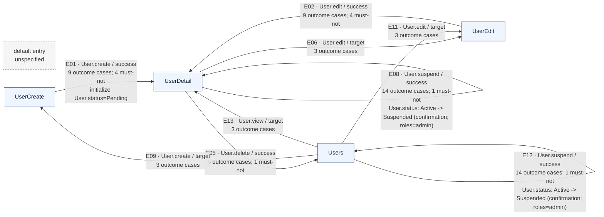

# Forma flow projection

- Schema: `forma/flow-projection/v0alpha3`
- Intent: `forma/resolved-intent/v0.11`
- Inputs: navigation `forma/navigation-projection/v0alpha2`; outcomes `forma/outcome-projection/v0alpha4`; states `forma/domain-state-projection/v0alpha1`
- Default entry: `unspecified` (not inferred)
- Navigation: 4 pages; 13 edges
- Outcomes linked to edges: 17/21 groups; 102/120 cases
- Domain state linked to edges: 5/5 elements; 6 edge annotations

## Edge index

| Ref | Route | Trigger / result | Outcome projection | Domain-state projection |
| --- | --- | --- | --- | --- |
| E01 | UserCreate -> UserDetail [page/UserCreate/view/form/create/User/submit/success] | User.create / success | UserCreate:User.create submit: 9 cases, 4 must-not [page/UserCreate/view/form/create/User/submit] | initialize User.status=Pending [projection/states/initializer/page/UserCreate/view/form/create/User/submit] |
<!-- E01: navigation=page/UserCreate/view/form/create/User/submit/success; sources=entity/User/field/email,entity/User/field/name,entity/User/field/team,entity/User/state/status,page/UserCreate,page/UserCreate/view/form/create/User,page/UserCreate/view/form/create/User/submit,page/UserCreate/view/form/create/User/submit/access,page/UserCreate/view/form/create/User/submit/success,page/UserDetail,type/Email/constraint/matches -->
| E02 | UserEdit -> UserDetail [page/UserEdit/view/form/edit/User/submit/success] | User.edit / success | UserEdit:User.edit submit: 9 cases, 4 must-not [page/UserEdit/view/form/edit/User/submit] | (none linked) |
<!-- E02: navigation=page/UserEdit/view/form/edit/User/submit/success; sources=entity/User/field/email,entity/User/field/name,entity/User/field/team,page/UserDetail,page/UserEdit,page/UserEdit/view/form/edit/User,page/UserEdit/view/form/edit/User/submit,page/UserEdit/view/form/edit/User/submit/access,page/UserEdit/view/form/edit/User/submit/success,type/Email/constraint/matches -->
| E03 | UserDetail -> UserDetail [projection/navigation/edge/page/UserDetail/view/detail/User/action/activate/success] | User.activate / success | User.activate: 4 cases [action/User/activate]; UserDetail:User.activate: 8 cases [page/UserDetail/view/detail/User/action/activate] | User.status: Confirmed -> Active [projection/states/transition/action/User/activate/from/Confirmed] |
<!-- E03: navigation=projection/navigation/edge/page/UserDetail/view/detail/User/action/activate/success; sources=action/User/activate,entity/User,entity/User/state/status,page/UserDetail,page/UserDetail/view/detail/User/action/activate,page/UserDetail/view/detail/User/action/activate/access -->
| E04 | UserDetail -> UserDetail [projection/navigation/edge/page/UserDetail/view/detail/User/action/confirm/success] | User.confirm / success | User.confirm: 4 cases [action/User/confirm]; UserDetail:User.confirm: 8 cases [page/UserDetail/view/detail/User/action/confirm] | User.status: Pending -> Confirmed [projection/states/transition/action/User/confirm/from/Pending] |
<!-- E04: navigation=projection/navigation/edge/page/UserDetail/view/detail/User/action/confirm/success; sources=action/User/confirm,entity/User,entity/User/state/status,page/UserDetail,page/UserDetail/view/detail/User/action/confirm,page/UserDetail/view/detail/User/action/confirm/access -->
| E05 | UserDetail -> Users [projection/navigation/edge/page/UserDetail/view/detail/User/action/delete/success] | User.delete / success | UserDetail:User.delete: 6 cases, 1 must-not [page/UserDetail/view/detail/User/action/delete] | (none linked) |
<!-- E05: navigation=projection/navigation/edge/page/UserDetail/view/detail/User/action/delete/success; sources=entity/User,page/UserDetail,page/UserDetail/view/detail/User/action/delete,page/UserDetail/view/detail/User/action/delete/access,page/Users -->
| E06 | UserDetail -> UserEdit [projection/navigation/edge/page/UserDetail/view/detail/User/action/edit/target] | User.edit / target | UserDetail:User.edit: 3 cases [page/UserDetail/view/detail/User/action/edit] | (none linked) |
<!-- E06: navigation=projection/navigation/edge/page/UserDetail/view/detail/User/action/edit/target; sources=page/UserDetail,page/UserDetail/view/detail/User/action/edit,page/UserDetail/view/detail/User/action/edit/access,page/UserEdit -->
| E07 | UserDetail -> UserDetail [projection/navigation/edge/page/UserDetail/view/detail/User/action/reinstate/success] | User.reinstate / success | User.reinstate: 4 cases [action/User/reinstate]; UserDetail:User.reinstate: 8 cases [page/UserDetail/view/detail/User/action/reinstate] | User.status: Suspended -> Active (roles=admin) [projection/states/transition/action/User/reinstate/from/Suspended] |
<!-- E07: navigation=projection/navigation/edge/page/UserDetail/view/detail/User/action/reinstate/success; sources=action/User/reinstate,entity/User,entity/User/state/status,page/UserDetail,page/UserDetail/view/detail/User/action/reinstate,page/UserDetail/view/detail/User/action/reinstate/access -->
| E08 | UserDetail -> UserDetail [projection/navigation/edge/page/UserDetail/view/detail/User/action/suspend/success] | User.suspend / success | User.suspend: 4 cases [action/User/suspend]; UserDetail:User.suspend: 10 cases, 1 must-not [page/UserDetail/view/detail/User/action/suspend] | User.status: Active -> Suspended (confirmation; roles=admin) [projection/states/transition/action/User/suspend/from/Active] |
<!-- E08: navigation=projection/navigation/edge/page/UserDetail/view/detail/User/action/suspend/success; sources=action/User/suspend,entity/User,entity/User/state/status,page/UserDetail,page/UserDetail/view/detail/User/action/suspend,page/UserDetail/view/detail/User/action/suspend/access,page/Users/view/list/User/action/suspend -->
| E09 | Users -> UserCreate [projection/navigation/edge/page/Users/view/list/User/action/create/target] | User.create / target | Users:User.create: 3 cases [page/Users/view/list/User/action/create] | (none linked) |
<!-- E09: navigation=projection/navigation/edge/page/Users/view/list/User/action/create/target; sources=page/UserCreate,page/Users,page/Users/view/list/User/action/create,page/Users/view/list/User/action/create/access -->
| E10 | Users -> Users [projection/navigation/edge/page/Users/view/list/User/action/delete/success] | User.delete / success | Users:User.delete: 6 cases, 1 must-not [page/Users/view/list/User/action/delete] | (none linked) |
<!-- E10: navigation=projection/navigation/edge/page/Users/view/list/User/action/delete/success; sources=entity/User,page/Users,page/Users/view/list/User/action/delete,page/Users/view/list/User/action/delete/access -->
| E11 | Users -> UserEdit [projection/navigation/edge/page/Users/view/list/User/action/edit/target] | User.edit / target | Users:User.edit: 3 cases [page/Users/view/list/User/action/edit] | (none linked) |
<!-- E11: navigation=projection/navigation/edge/page/Users/view/list/User/action/edit/target; sources=page/UserEdit,page/Users,page/Users/view/list/User/action/edit,page/Users/view/list/User/action/edit/access -->
| E12 | Users -> Users [projection/navigation/edge/page/Users/view/list/User/action/suspend/success] | User.suspend / success | User.suspend: 4 cases [action/User/suspend]; Users:User.suspend: 10 cases, 1 must-not [page/Users/view/list/User/action/suspend] | User.status: Active -> Suspended (confirmation; roles=admin) [projection/states/transition/action/User/suspend/from/Active] |
<!-- E12: navigation=projection/navigation/edge/page/Users/view/list/User/action/suspend/success; sources=action/User/suspend,entity/User,entity/User/state/status,page/UserDetail/view/detail/User/action/suspend,page/Users,page/Users/view/list/User/action/suspend,page/Users/view/list/User/action/suspend/access -->
| E13 | Users -> UserDetail [projection/navigation/edge/page/Users/view/list/User/action/view/target] | User.view / target | Users:User.view: 3 cases [page/Users/view/list/User/action/view] | (none linked) |
<!-- E13: navigation=projection/navigation/edge/page/Users/view/list/User/action/view/target; sources=page/UserDetail,page/Users,page/Users/view/list/User/action/view,page/Users/view/list/User/action/view/access -->

## Unlinked projection index

Items below are still available in the detailed projections. They are listed here so the overview cannot imply complete outcome or state coverage.

### Outcomes not attached to a navigation edge (4)

- `UserCreate:User.create form`: 3 cases (`page/UserCreate/view/form/create/User`)
- `UserDetail:User.detail`: 4 cases (`page/UserDetail/view/detail/User`)
- `UserEdit:User.edit form`: 3 cases (`page/UserEdit/view/form/edit/User`)
- `Users:User.list`: 8 cases (`page/Users/view/list/User`)

### Domain-state elements not attached to a navigation edge (0)

- (none)
